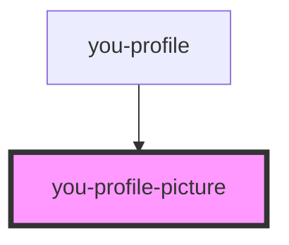

# you-profile-picture

<!-- Auto Generated Below -->

## Properties

| Property | Attribute | Description | Type     | Default     |
| -------- | --------- | ----------- | -------- | ----------- |
| `image`  | `image`   |             | `string` | `undefined` |

## Dependencies

### Used by

 - [you-profile](../you-profile)

### Graph

----------------------------------------------

*Built with [StencilJS](https://stenciljs.com/)*
